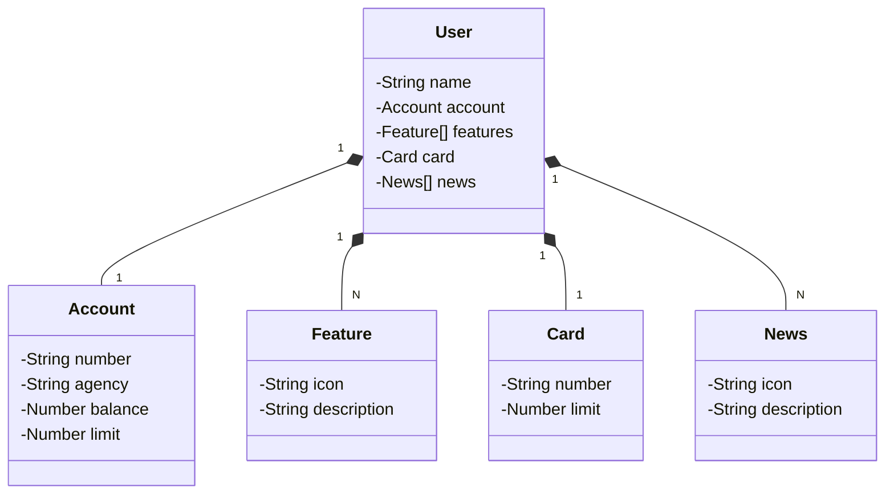

# Bradesco - Java Cloud Native

API RESTful desenvolvida para o Bootcamp Bradesco - Java Cloud Native, no módulo de Desenvolvimento de APIs.

## Principais Tecnologias
 - **Java 17**: Versão LTS (Long-Term Support) que oferece melhorias de desempenho, segurança e novas funcionalidades, garantindo maior estabilidade e suporte a longo prazo;
 - **Spring Boot 3**: Maximiza a produtividade do desenvolvedor com sua poderosa premissa de autoconfiguração, simplificando o desenvolvimento de aplicações robustas e escaláveis;
 - **Spring Data JPA**: Facilita a interação com bancos de dados SQL, reduzindo a necessidade de código boilerplate e otimizando a camada de persistência de dados;
 - **OpenAPI (Swagger)**: Permite a criação de uma documentação clara e interativa da API, facilitando a compreensão e integração por outros desenvolvedores;
 - **Railway**: Plataforma que simplifica o deploy e monitoramento de aplicações na nuvem, oferecendo suporte a bancos de dados como serviço e pipelines de CI/CD para automação do ciclo de vida da aplicação.

## Diagrama de Classes (Domínio da API)

